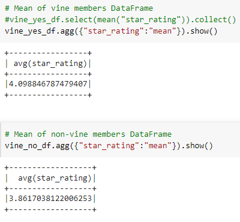

# Amazon_Vine_Analysis

## Overview of the analysis
The purpose of this analysis is to analyze a Amazon review wrote by Amazon Vine members and not vine members. A service that allows manufacturers and publishers to receive reviews of their products and determine if there are any biases between Vine members and Non-Vine member's reviews.

Therefore in order to determine any bias towards favorable reviews, we need to identify the percentage of 5 star ratings to total rating. As part of this exercise, we were asked to choose from 50 datasets to extract, transform and load (ELT) into a dataframe in order to complete our analysis.  
- PySpark to extract the dataset, transform the data, connect to AWS RDS instance and load the transformed data into pgAdmin.
- Google Colaboratory to import PySpark libraries and connect to Postgres in order to create SQL tables and export the results.
For this analysis I used "amazon_reviews_us_Camera_v1_00.tsv.gz" from the Amazon review dataset. 

## Results 
1. I created a vine DataFrame with the columns needed. 

  

2. I created a second DataFrame from step 1, where the total of votes count is equal or greater than 20.

 

3. Created a third DataFrame from step 2, where the number of helpful_votes divided by total_votes is equal to or greater than 50%

4. Created 2 DataFrames from step 3, where reviews where written by vine members and non-vine members

In the table below we can se the results.

a) How many Vine reviews and non-Vine reviews were there?
 -Vine members are 1.008%(607)  
 -Non-vine members are 98.991%(50522)

b) How many Vine reviews were 5 stars? How many non-Vine reviews were 5 stars?
 -Vine members rated 5 stars are 257 of 607 
 -Non-vine members rated 5 stars are 25,220 of 50,522

c) What percentage of Vine reviews were 5 stars? What percentage of non-Vine reviews were 5 stars?
- 42.33% reviews vine members were rated 5 stars
- 49.91% reviews non-vine were rated 5 stars

## Summary
Based on the results, Vine members did not show bias when rating their products considering that the number of 5-star ratings was less than Non-Vine members. We can assume that Vine customers are more critical when submitting their review. An additional analysis to get the means of the column "star_rating" we can see that for vine members there is a 4.09 mean and for non-vine "star_rating" there is a 3.86 mean. So we can determine that vine members rate higher than non-vine members, but we have to consider that there are far more non-vine mebers than vine members.

