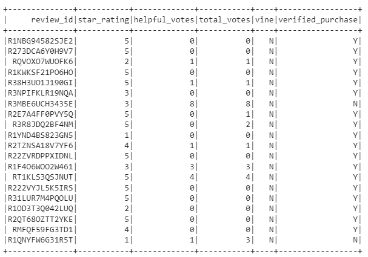
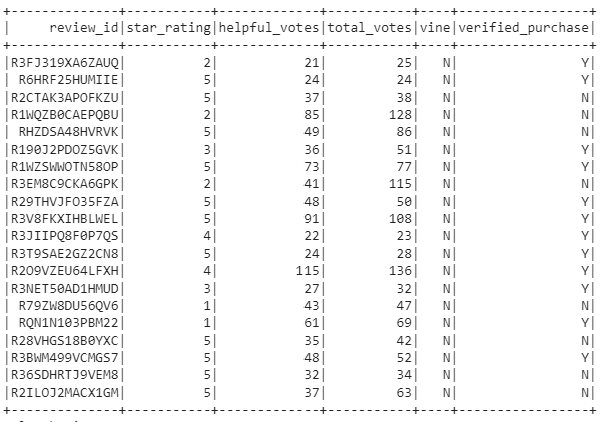
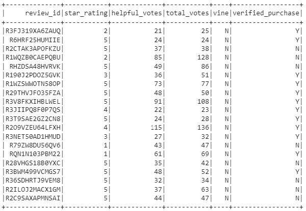
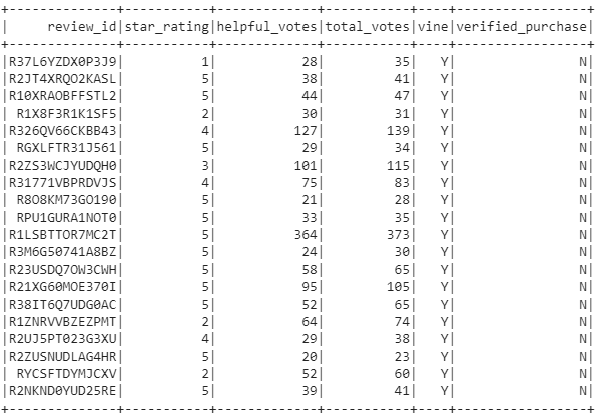
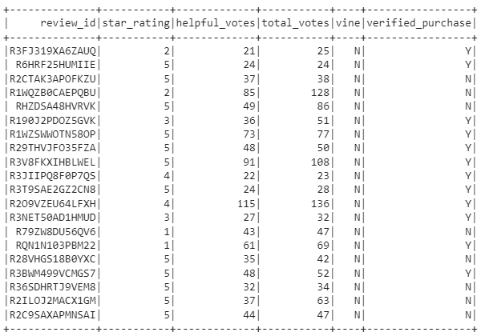
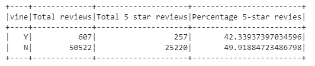

# Amazon_Vine_Analysis

## Overview of the analysis
The purpose of this analysis is to analyze a Amazon review wrote by Amazon Vine members and not vine members. A service that allows manufacturers and publishers to receive reviews of their products and determine if there are any biases between Vine members and Non-Vine member's reviews.

Therefore in order to determine any bias towards favorable reviews, we need to identify the percentage of 5 star ratings to total rating. As part of this exercise, we were asked to choose from 50 datasets to extract, transform and load (ELT) into a dataframe in order to complete our analysis.  
- PySpark to extract the dataset, transform the data, connect to AWS RDS instance and load the transformed data into pgAdmin.
- Google Colaboratory to import PySpark libraries and connect to Postgres in order to create SQL tables and export the results.
For this analysis I used "amazon_reviews_us_Camera_v1_00.tsv.gz" from the Amazon review dataset. 

## Results 
Step 1.
I created a vine DataFrame with the columns needed. 
  

Step 2
I created a second DataFrame from step 1, where the total of votes count is equal or greater than 20.
 

Step 3
Created a third DataFrame from step 2, where the number of helpful_votes divided by total_votes is equal to or greater than 50%

Step 4
Created 2 DataFrames from step 3, where reviews where written by vine members and non-vine members

In the table below we can se the results in a table 

## Summary

